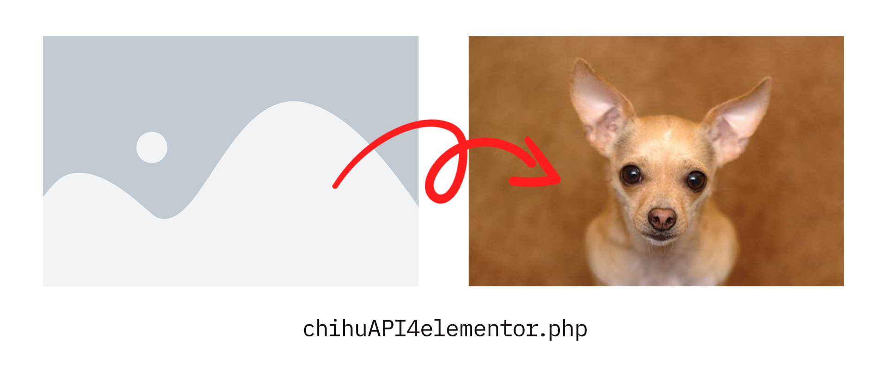

# ChihuAPI for Elementor

ChihuAPI for Elementor Plugin is a fun project aimed at replacing Elementor placeholder images with random chihuahua images fetched from the dog.ceo API. Instead of displaying the default placeholder image provided by Elementor, this plugin adds a touch of humor by displaying adorable dog images as placeholders.

## Why not using a hook?

Initially, I attempted to use the **elementor/utils/get_placeholder_image_src** hook provided by Elementor to replace placeholder images. However, it was discovered that this hook is only executed once during the page rendering process, resulting in all placeholder images using the same URL generated by the hook.

To overcome this limitation and ensure that each placeholder image is unique, the plugin instead **dynamically replaces placeholder images using JavaScript** after the page has fully loaded. This approach allows for a diverse range of dog images to be displayed as placeholders, enhancing the developer experience.

## How to Contribute

Contributions to this project are welcome and encouraged! If you have ideas for improvements, additional features, or bug fixes, please **feel free to open an issue or submit a pull request**. Together, we can make this plugin even more fun and delightful for users.

## License

This project is licensed under the [GNU General Public License v3.0](LICENSE). Feel free to modify, distribute, and use the code in your own projects.

